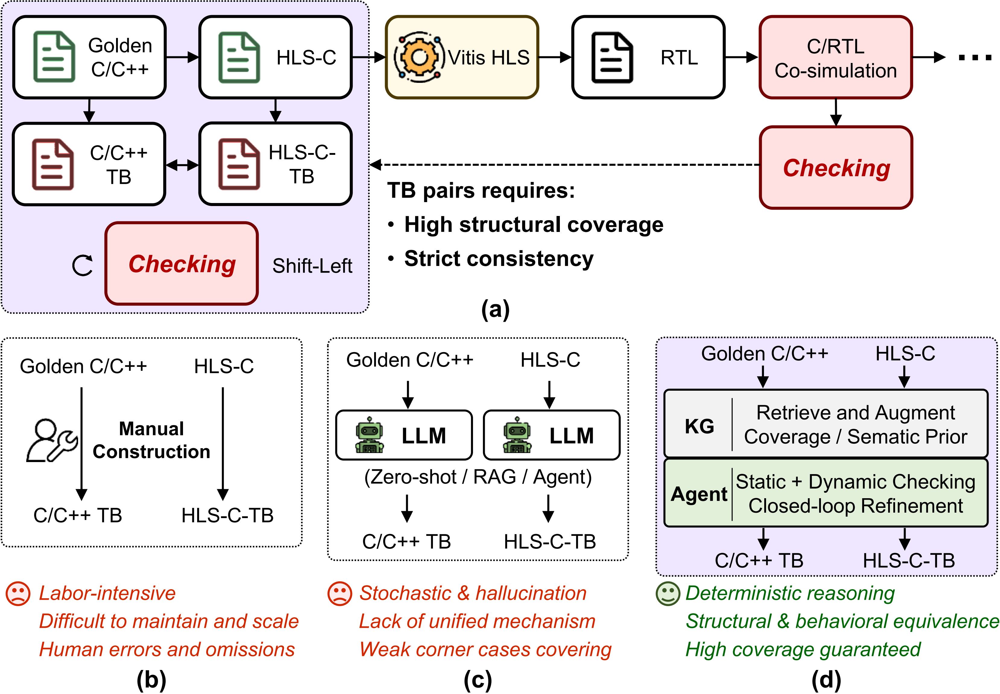
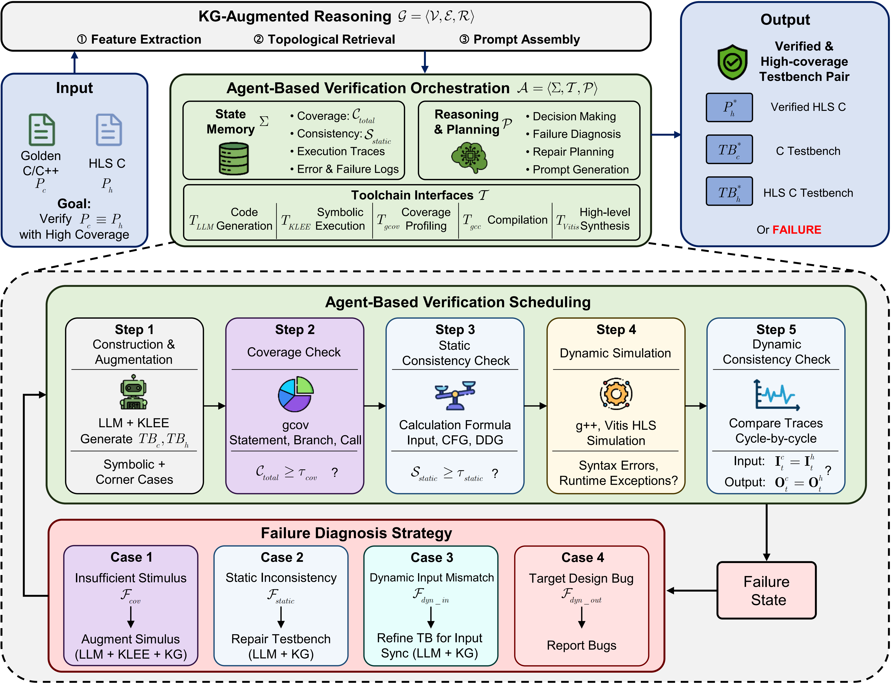
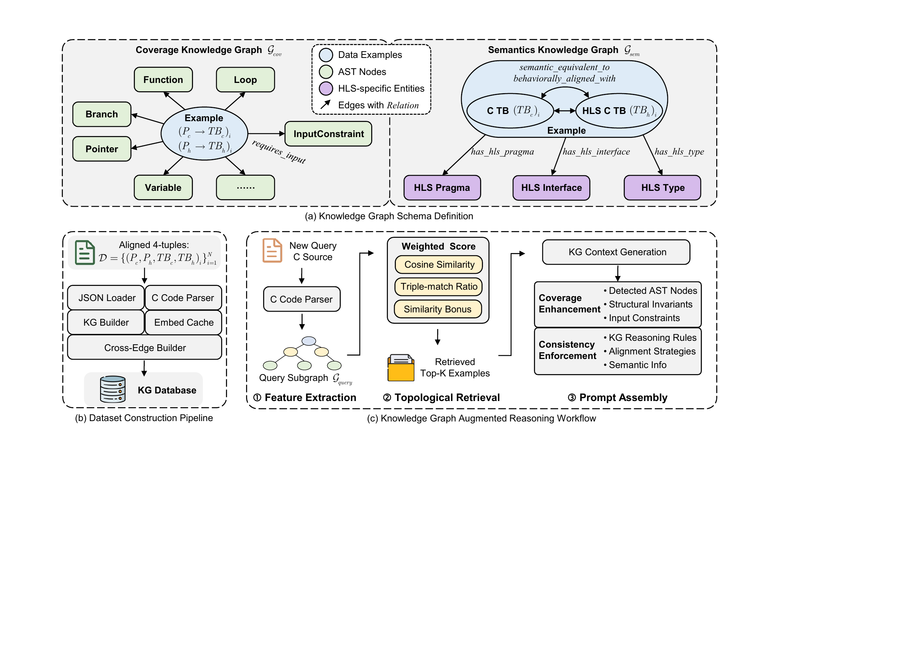

# HLS-LeVeri

Official repository for **Shift-Left High-Level Synthesis Verification via Knowledge-Augmented LLM Agent**.

## Authors

Zhihan Xiao, Zhe Zhao, Luke Ztz Hu, and Songping Mai

Shenzhen International Graduate School, Tsinghua University, Shenzhen, China

## Overview

High-Level Synthesis (HLS) translates C/C++ programs into hardware implementations, but functional consistency between golden C specifications and HLS-oriented C implementations is still hard to verify before synthesis. HLS-LeVeri targets this shift-left verification stage: it automatically constructs high-coverage and semantically aligned testbench pairs for golden C and HLS-C programs, then checks whether observed mismatches come from the target design or from the generated testbench itself.

The framework combines three ideas:

- **Dual-tier consistency checking**: static structural alignment over input stimuli, control flow, and data dependency, followed by dynamic behavioral consistency over execution traces.
- **Coverage-driven refinement**: symbolic execution and coverage profiling guide the generation of corner-case stimuli until the verification target reaches sufficient structural coverage.
- **Knowledge-augmented LLM agent**: a heterogeneous HLS verification knowledge graph provides reusable structural priors, while the agent orchestrates LLM generation, KLEE, gcov, gcc, and Vitis HLS in a closed loop.

## Paper Figures

### Shift-Left Verification Motivation



### Knowledge-Augmented Verification Agent



### HLS Verification Knowledge Graph



## Open Dataset Preview

This repository currently releases an initial dataset preview:

- [`summary_hlstrans_tcl_h.json`](summary_hlstrans_tcl_h.json)
- Contains **107 independent verification targets filtered and enhanced from hlstrans**
- Each entry summarizes paired C / HLS-C benchmark information for shift-left HLS verification research

The paper further constructs a larger verified 4-tuple dataset:

```text
(P_c, P_h, TB_c, TB_h)
```

where `P_c` is the golden C/C++ program, `P_h` is the HLS-oriented implementation, `TB_c` is the golden C testbench, and `TB_h` is the HLS-C testbench.

Unlike prior resources that provide only partial verification artifacts, our dataset includes the complete C / HLS-C / C-Testbench / HLS-C-Testbench structure.

| Dataset   | C | HLS-C | C-TB | HLS-C-TB |
|------------|---|--------|------|----------|
| HLSDataset | ✗ | ✓ | ✗ | ✓ |
| HLS-Eval   | ✗ | ✓ | ✗ | ✓ |
| HLSTrans   | ✓ | ✓ | ✗ | ✗ |
| HLSPilot   | ✓ | ✓ | ✗ | ✗ |
| **Ours**   | ✓ | ✓ | ✓ | ✓ |


## Citation

The arXiv version has just been submitted. Citation information will be updated after the arXiv identifier is available.

```bibtex
@misc{xiao2026hlsveriagent,
  title  = {Shift-Left High-Level Synthesis Verification via Knowledge-Augmented LLM Agent},
  author = {Xiao, Zhihan and Zhao, Zhe and Hu, Luke Ztz and Mai, Songping},
  year   = {2026},
  note   = {arXiv preprint}
}
```

## Contact

For questions, please contact Zhihan Xiao at `xiaozh24@mails.tsinghua.edu.cn`.
